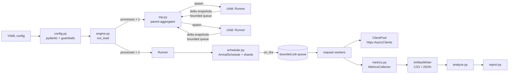

# Architecture

## Components

| Module | Responsibility |
|---|---|
| `config.py` | Pydantic schema, `${ENV}` expansion, CLI overrides, allowlist + RPS-cap checks |
| `scheduler.py` | Deterministic arrival times, sharding, CO-safe firing loop |
| `http_client.py` | Route preparation, sharded `httpx.AsyncClient` pool, warm-up, redirect guard |
| `engine.py` | `Runner` (scheduler → queue → workers → metrics), signals, artifacts, summaries |
| `mp.py` | Multiprocess sharding, start barrier, delta aggregation |
| `metrics.py` | Per-second windows, 100 ms fine bins, per-route counters, HDR histograms, header stats |
| `analyze.py` | Sustained / burst / step / fairness / headers / window-semantics analysis |
| `demo_server.py` | FastAPI app + lean ASGI fast path with token-bucket / fixed / sliding limiters |
| `logging.py` | JSON logs and `redact()` |

## Request flow

1. `ArrivalSchedule` turns the profile into segments with cumulative arrival function
   `Λ(t)`. Event `k` fires at `Λ⁻¹(k)` (closed form for constant and linear-ramp segments).
2. Shard `s` of `N` owns events `k ≡ s (mod N)`; shards therefore interleave exactly and
   never burst in lock-step.
3. Each shard sleeps until `start + offset` (`perf_counter`), then calls `on_fire`, which
   records the attempt in the **scheduled** window and enqueues a job. If the bounded
   queue is full the attempt is recorded as `dropped` (client saturation) — the
   scheduler itself never blocks.
4. Workers (pinned round-robin to small client pools) send the request, read the body,
   and record status, latency and rate-limit headers.
5. Once per `flush_interval` the writer freezes windows older than the timeout grace,
   rewrites `metrics.csv`, flushes sampled events and logs progress.

## Accuracy considerations (coordinated omission)

A closed-loop tester that waits for responses before sending the next request silently
lowers its rate when the server slows down, hiding exactly the latency you want to see
("coordinated omission"). `lt` avoids this:

- **Open model**: send times depend only on the profile. When the process falls behind
  (GC pause, CPU contention) it fires the backlog immediately instead of skipping events.
- **Latency from scheduled time**: `latency = t_end − t_scheduled` (or from the actual
  send when a timer fires marginally early). Queueing inside the client is included.
- **Binning by scheduled time**: a request scheduled in second 7 counts in second 7 even
  if it completes in second 9, so per-second attempted RPS equals the plan.
- **Scheduler self-check**: `summary.json → scheduler` reports `rate_error_pct`, the mean
  absolute per-window error and the fire-lag distribution. High lag means the client host
  is saturated; add processes.
- **Timer precision**: on Windows the event loop clock is replaced with
  `QueryPerformanceCounter` and `timeBeginPeriod(1)` is requested, reducing timer
  granularity from ~15.6 ms to ~1 ms. On POSIX the default monotonic clock (or uvloop) is
  used.

## Metrics model

- 1 s windows: attempted, accepted (2xx/3xx), 429, errors, dropped and an HDR histogram
  (2 significant figures) that is released when the window is finalized.
- Run-level HDR histograms (3 significant figures) overall and per status family, plus a
  scheduler lag histogram.
- 100 ms fine bins (attempted/accepted/429) for burst regression and phase folding.
- Header stats: presence, counts on 429, numeric min/max/mean, top distinct values.

Histograms merge by sparse bucket index (not hdrhistogram's C `add`/`encode`, which
overflow on 64-bit Windows), so multiprocess merges are exact and portable.

## Multiprocessing

The parent spawns `processes` children (spawn start method on all platforms). Each child
warms its pools, reports `ready`, waits for a shared wall-clock start, then runs its shard
subset. Every flush interval it sends a *delta* collector state; on a full queue it keeps
accumulating and retries, so no data is lost and the child never blocks. The parent
merges deltas, writes snapshots, forwards Ctrl-C via a shared event, and enforces a hard
deadline.
